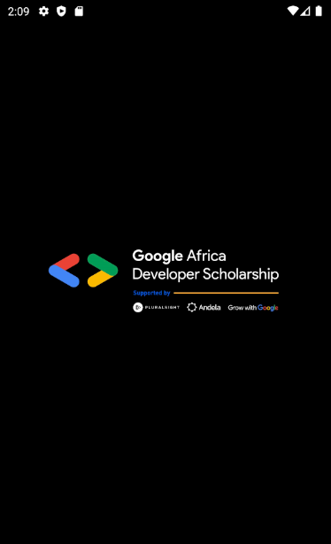
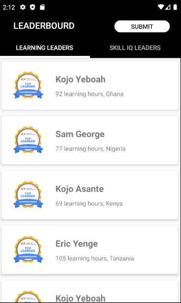
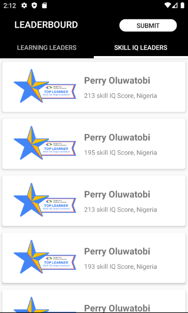
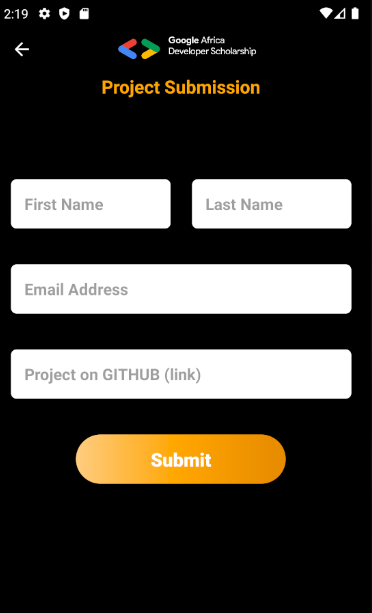
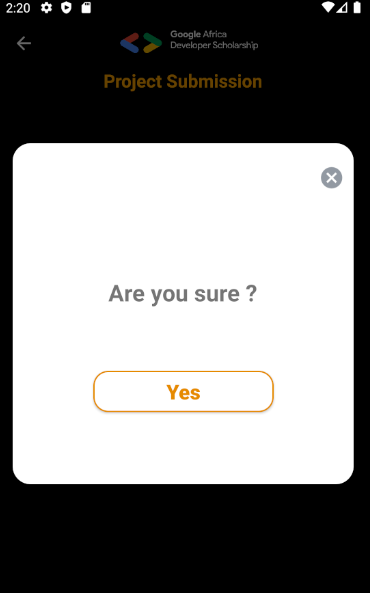
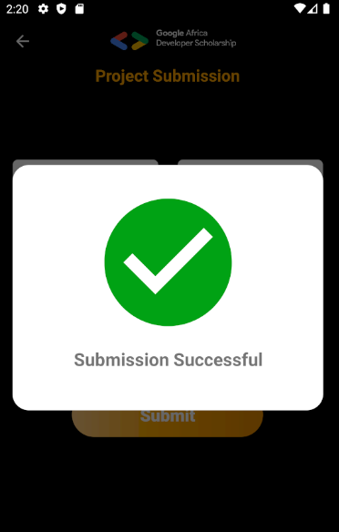
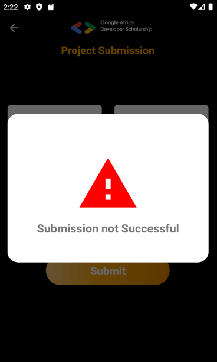

# LeaderBoard
This project is a very simple Android Project aimed at getting you to implement some simple concepts that are very important as far as Android Development is concerned.

In this project, you are going to implement a mobile design of the GADS 2020 Leaderboard.
The mobile App will display Top 20 learners in the Learning Leaders’ category and Top 20 learners in the Skill IQ Leaders’ category.

### What Will I Learn from this project?
* Multi-Activity Project
* View pager
* Customizing Toolbar
* RecyclerView
* Making Network Request
* Working with Google Form and many more...

### Build Instructions
This sample uses the Gradle build system. To build this project, use the
"gradlew build" command or use "Import Project" in Android Studio.

### screenshots

